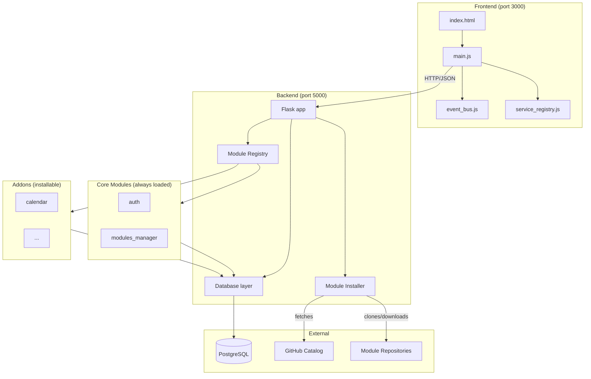
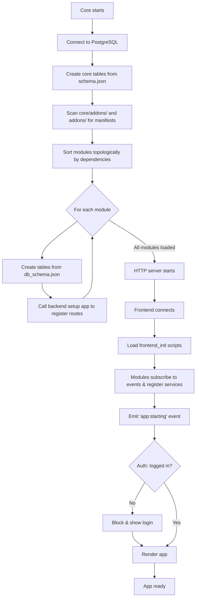

# HomeDoo

A modular home management application built with a plugin-based architecture, designed to demonstrate clean separation of concerns, data-driven module loading, and dynamic plugin installation.

This project is born during a 25 days python and Odoo training program @Technocité - Hornu. It is a learning-by-doing project, which has influenced some of the design decisions described below.

## Overview

HomeDoo is a personal home management platform inspired by Odoo's modular architecture. The core provides infrastructure for installing, managing, and orchestrating independent modules, each with their own backend and frontend code.

The architecture is built around three principles:
- **Modularity**: features are isolated as self-contained modules
- **Data-driven loading**: modules declare themselves via manifest files
- **Runtime extensibility**: modules can be installed and removed without modifying the core

## Tech Stack

## Tech Stack

| Layer | Technology | Version      |
|---|---|--------------|
| Backend language | Python | 3.12         |
| HTTP server | Flask | 3.1.3        |
| Database | PostgreSQL | 16           |
| Database driver | psycopg2 | 2.9.11       |
| Authentication | bcrypt + PyJWT | latest       |
| Dependency management | Poetry | latest       |
| Frontend | Vanilla JavaScript | ES2022       |
| Markup & styling | HTML / CSS | HTML5 / CSS3 |

No build step, no framework on the frontend. ES modules are served directly by Python's `http.server`.

## Note on AI Assistance

The frontend UI (HTML structure, CSS, and JavaScript event handlers) was largely generated
with the help of an AI assistant. The architectural decisions, backend code, frontend
patterns (EventBus, ServiceRegistry), and overall design are my own work, developed through
iterative discussion. This allowed me to focus my learning effort on the backend
architecture and Odoo-aligned patterns, which were the core objectives of this training.

## Architecture

### Architecture Overview



### Project Structure

```bash
HomeDoo/
├── core/
│   ├── backend/
│   │   ├── app.py                  # Flask entry point
│   │   ├── config.py               # Environment configuration
│   │   ├── database/               # Database access layer
│   │   ├── modules/                # Module registry & installer infrastructure
│   │   └── utils.py                # Shared utilities (singleton decorator)
│   │
│   ├── frontend/
│   │   ├── index.html
│   │   ├── js/
│   │   │   ├── main.js             # Application bootstrap
│   │   │   ├── event_bus.js        # Pub/sub for module communication
│   │   │   └── service_registry.js # Service locator pattern
│   │   └── styles/
│   │
│   └── addons/                     # Core modules (always loaded)
│       ├── auth/                   # Authentication module
│       └── modules_manager/        # Module installation UI
│
├── addons/                         # User-installable modules
│   └── calendar/                   # Example module
│
└── start.sh                        # Development start script
└── start.ps1                       # Development start script
````
### Core Concepts

**Core**: The foundational layer that provides infrastructure (HTTP server, database, module loading). It does not contain business logic.

**Core modules** (`core/addons/`): Modules that are always loaded with the core. They cannot be uninstalled. Authentication is implemented as a core module to allow easy replacement without touching the core.

**Addons** (`addons/`): User-installable modules. They are downloaded, registered, and loaded dynamically.

**Module manifest** (`module.json`): Each module declares itself through a manifest:
```json
{
    "name": "Calendar",
    "version": "1.0.0",
    "core_module": false,
    "db_schema_path": "./backend/tables_schema.json",
    "frontend_path": "./frontend/js/calendar.js",
    "frontend_init": "./frontend/js/calendar_init.js",
    "dependencies": ["auth"]
}
```

### Module Loading Flow



### Module Installation

Modules are installed in two modes depending on the `ENVIRONMENT` variable:

**Production mode (zip)**: Downloads a zip archive from GitHub, extracts it, reads the manifest, and registers the module in the database.

**Development mode (submodule)**: Clones the module as a git submodule, allowing direct development on the module repository.

A central catalog (hosted on a separate GitHub repository) provides a list of available modules. Custom URLs are also supported for installations outside the catalog.

### Authentication

The `auth` module provides:
- Two-table design: `auth_persons` (any human in the system) and `auth_accounts` (login credentials linked to a person)
- Password hashing with bcrypt
- JWT-based stateless authentication
- A `@login_required` decorator for protected routes
- Frontend service registration so other modules can use authentication helpers without coupling to the auth module

The separation between persons and accounts allows for non-login users (e.g., children in a family) to be referenced by other modules.

### Database Layer

A `Database` class encapsulates PostgreSQL operations:
- Helpers built on top of `psycopg2.sql` to prevent SQL injection
- Generic methods: `fetch_all`, `fetch_where`, `fetch_join`, `insert_item`, `update_item`, `delete_item`
- Transaction support via `execute_transaction(callback)` using the Execute Around Method pattern
- Schema parser that creates tables from JSON declarations, including foreign key references

### Frontend Patterns

**EventBus**: Pub/sub mechanism for module communication. Used to decouple application bootstrap (auth blocks rendering via `app:starting` event).

**ServiceRegistry**: Service locator pattern allowing modules to expose APIs without direct imports. The auth module registers `getToken`, `authHeaders`, `getPerson`, `logout` as the `auth` service. Other modules retrieve it without knowing the implementation source.

## Setup

### Prerequisites

- Python 3.12+
- PostgreSQL 16+
- Poetry
- Git (required for development mode)

### Installation

1. Clone the repository:
```bash
git clone https://github.com/ThibNach/HomeDoo
cd HomeDoo
```

2. Install dependencies:
```bash
cd core/backend
poetry install
```

3. Create a PostgreSQL user:
```sql
CREATE USER homedoo WITH PASSWORD 'your_password' CREATEDB;
```

4. Copy `.env.example` to `.env` and fill in the values:

```bash
FLASK_ENV=development
FLASK_PORT=5000
ENVIRONMENT=development
DB_HOST=localhost
DB_PORT=5432
DB_NAME=db_homedoo
DB_USER=homedoo
DB_PASSWORD=your_password
JWT_SECRET=<generate_with_python_secrets>
```

5. Generate a JWT secret:
```bash
python -c "import secrets; print(secrets.token_hex(32))"
```

6. Start the application:
```bash
./start.sh
```

The backend runs on `http://127.0.0.1:5000` and the frontend on `http://127.0.0.1:3000`.

### First Use

1. Open `http://127.0.0.1:3000`
2. Click "Register" and create your first account
3. Click the settings icon, then "Modules" to install additional modules from the catalog

## Design Decisions

### Why no ORM?

Using `psycopg2` directly with `sql.SQL` and `sql.Identifier` provides full control over queries while keeping injection safety. The custom database layer encapsulates this complexity, exposing a high-level API to module repositories. This also avoids the magic of ORMs and keeps the SQL transparent for the reader.
This also allowed me to stay closer to plain PostgreSQL, which was useful for the learning aspect.

### Why JWT over server sessions?

JWT is stateless, which fits a modular architecture where modules may scale independently in the future.

### Why no build step on the frontend?

For a demo project, a build step adds complexity without significant benefit. Native ES modules and dynamic imports are sufficient. The architecture supports adding a build step later if needed.

### Why two modes for module installation?

In development, `git submodule` allows live editing of modules within the main repository. In production, downloading a zip archive removes the dependency on git for end users. The choice is driven by the `ENVIRONMENT` variable.

### Why a service registry on the frontend?

Modules need to share helpers (e.g., authentication headers) without creating direct dependencies. The service registry decouples consumers from providers — any module can register itself as the `auth` service, allowing replacement without touching consumers.

## Known Limitations and Future Improvements

### Architecture
- **Cross-module foreign keys**: References between module tables use a hardcoded prefix convention. A more robust approach would resolve `module.table` notation at parse time, validate against module dependencies, and enforce explicitly exposed tables.
- **Frontend EventBus for runtime events**: The current EventBus is used only at bootstrap. Extending it for runtime events (e.g., `user:logged_in`, `entry:created`) would enable cross-module reactions without coupling.
- **Hot module reload**: Currently, installing or uninstalling a module requires a server restart. A hot reload mechanism would improve user experience.
- **Migration system**: Tables are created with `IF NOT EXISTS`. There is no support for schema evolution. Adding migrations (Alembic or custom) would handle versioned schema changes.

### Security
- **Refresh tokens**: JWTs expire after 24 hours, requiring a full re-login. Adding refresh tokens would allow seamless session extension.
- **Rate limiting**: No protection against brute-force on login or registration endpoints.
- **HTTPS**: The setup runs on HTTP only. Production deployment would require TLS termination.

### Code Quality
- **Tests**: The project has no automated tests. Unit tests on repositories and integration tests on the install/uninstall flow would be the next priority.
- **Logging**: Errors are currently raised without structured logging. Integrating Python's `logging` module would improve observability.
- **Frontend CSS organization**: Common styles (modals, buttons, list items) are duplicated across modules. Moving shared styles to the core would reduce duplication.

### Functional
- **Permissions**: All authenticated users have full access. A role/permission system would be needed for multi-user households with different access levels.

## License

MIT